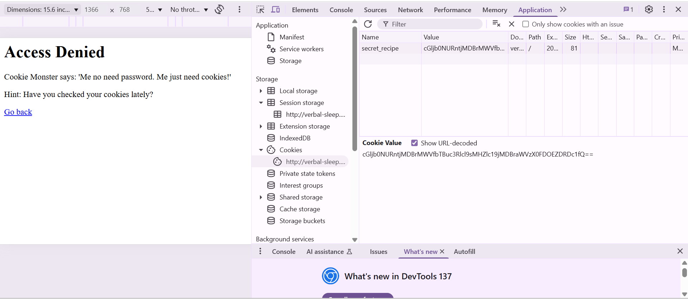
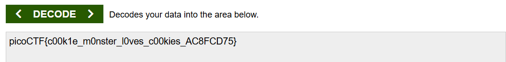

# 🍪 Cookie Monster Secret Recipe

## 🧩 Challenge Description

You're given a login page that says:

> **Access Denied**  
> Cookie Monster says: *"Me no need password. Me just need cookies!"*  
> *Hint: Have you checked your cookies lately?*

No working login form. The trick is in the browser cookie.

---

## 🛠️ Tools Used

- Browser (Chrome/Firefox)
- Developer Tools (F12)
- [base64decode.org](https://www.base64decode.org/)

---

## 🧪 Exploitation Steps

### 🔍 Step 1 – Visit the page

- Accessed the login page → Got "Access Denied" with a cookie-related hint.

### 🔎 Step 2 – Check the cookie

- Opened browser **DevTools** → `Application` tab → `Cookies`.

- Found a cookie named: secret_recipe = cGljb0NURntjMDBrMWVfbTBuc3Rl9sMHZlc19jMDBraWVzX0FDOEZDRDc1fQ==

👉 Here's what it looked like in the browser:

---

### 🧪 Step 3 – Decode the cookie

- Copied the `secret_recipe` value and decoded it using:  
🔗 [base64decode.org](https://www.base64decode.org/)

- Paste the value and hit “DECODE”  
→ You get the **flag** in plain text.

👉 Visual result:

---

## 🏁 Flag

picoCTF{c00k1e_m0nster_l0ves_c00kies_AC8FCD75}

---

✅ This challenge is about noticing that authentication is faked, and the flag is literally sitting inside a Base64-encoded cookie.

